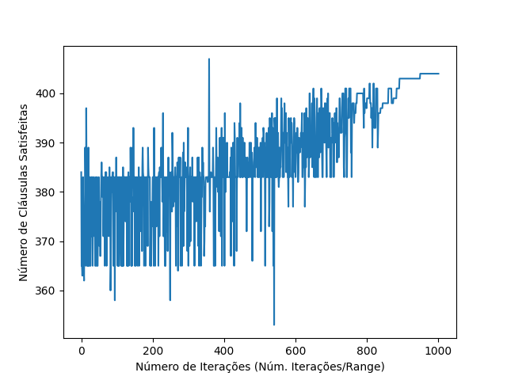
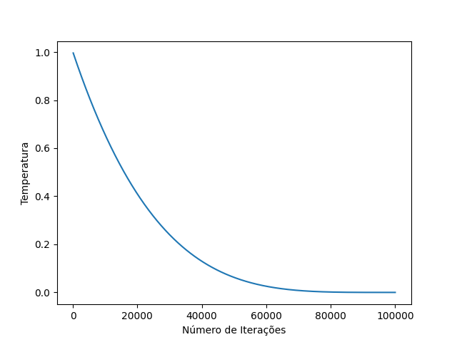

# 3-SAT-SA

Utilização do Simulated Annealing (SA) para resolução do problema 3-SAT 

### Entrada:
- Arquivo .cnf Uniform Random-3-SAT:
    - ufXX-YY-ZZ: XX variáveis, YY cláusulas, ZZ instância da base SATLIB sendo otimizada 

### Saída:

